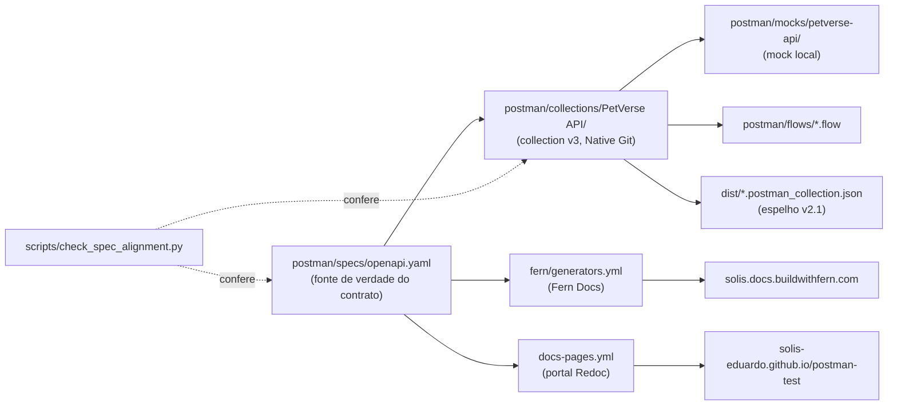

# Visão geral: como Postman e Fern se integram neste repositório

Este arquivo é o mapa geral — o que configura o quê, e como cada peça se
mantém atualizada. Para o detalhe/troubleshooting de cada sistema, veja:

- `docs/postman-git-native.md` — formato da collection/ambientes/mocks/flows.
- `docs/fern-docs.md` — setup, autenticação e publicação da documentação.

## O princípio central: uma spec, três consumidores

`postman/specs/openapi.yaml` é editada **uma vez** e alimenta três saídas
publicadas independentes (collection, Fern Docs, portal Redoc). Nada além do
`scripts/check_spec_alignment.py` garante que a collection não driftou da
spec — os dois são artefatos editáveis separadamente (um pela UI do Postman,
outro editando YAML), então essa checagem roda em todo `npm run lint` e no CI,
cobrindo endpoints, tags/agrupamento (usadas pela Fern pra montar a navegação)
e schema de body/response (JSON Schema, via `jsonschema`).

## Mapa de pastas/arquivos → responsabilidade

| Caminho | Configura | Quem lê/escreve | Fonte de verdade? |
|---|---|---|---|
| `postman/specs/openapi.yaml` | Contrato da API (paths, schemas, auth) | Editado à mão; lido por `fern/generators.yml`, `docs-pages.yml`, `scripts/check_spec_alignment.py` | **Sim** — é o contrato |
| `postman/collections/PetVerse API/` | Requests, exemplos, scripts de teste | Postman Desktop (Native Git) lê/escreve; `scripts/export_v2_collection.py` lê pra gerar `dist/` | Sim, mas pra **comportamento observável** (exemplos, testes) — não pro contrato formal |
| `postman/environments/*.environment.yaml` | Variáveis por ambiente (`base_url`, credenciais) | Editado pelo Postman Desktop (UI) | Sim, pra qual URL cada ambiente aponta |
| `postman/mocks/petverse-api/config.yaml` | Porta/protocolo do mock local | Editado pelo Postman Desktop (UI) | Sim, só pra "em que porta o mock escuta" — **precisa bater manualmente** com `base_url` do ambiente Local (Postman não sincroniza os dois; ver `docs/postman-git-native.md`) |
| `postman/mocks/petverse-api/default.js` | Respostas do mock por rota | Gerado pelo Postman a partir dos exemplos salvos; editado à mão quando falta exemplo | Não — é derivado dos exemplos da collection |
| `postman/flows/*.flow` | Orquestração visual de requests (grafo) | Postman Desktop (editor de Flows) | Não — referencia `.request.yaml` por caminho, não duplica config |
| `.postman/resources.yaml` | A qual workspace/organização Postman este repo está ligado; quais arquivos fora de `postman/` são registrados | Escrito pelo Postman Desktop ao conectar; editado à mão quando precisa registrar algo (ex.: a spec, ver `docs/postman-git-native.md`) | Sim, pro vínculo repo↔workspace |
| `fern/fern.config.json` | Organização Fern + versão do CLI | Editado à mão (ou via commit direto no GitHub pelo Fern Editor) | Sim, pra qual organização Fern este repo publica |
| `fern/generators.yml` | De onde a Fern lê a definição da API | Aponta pra `postman/specs/openapi.yaml` — editado à mão | Não é fonte, é **referência** à spec |
| `fern/docs.yml` | Domínio, título, navegação, tema do site publicado | Editado à mão | Sim, pra aparência/URL do site |
| `dist/*.postman_collection.json` | Espelho v2.1 da collection | **Gerado**, nunca editado à mão (`npm run export:v2`) | Não — é derivado; em push direto na `main` o CI regenera e **commita sozinho** se estiver desatualizado; em PR, só falha e pede pra alguém rodar local |
| `scripts/check_spec_alignment.py` | Confere spec ↔ collection | — | N/A (é a checagem, não a fonte) |
| `.github/workflows/*.yml` | Quando cada validação/publicação roda | — | N/A |

## Como o Postman se mantém atualizado

**Bidirecional, via Native Git**: o Postman Desktop observa a pasta `postman/`
deste repositório. Editar pela UI do app (criar request, mudar variável de
ambiente, desenhar um flow) escreve nos arquivos `*.yaml`/`*.flow` locais;
editar esses arquivos manualmente e dar `git pull` reflete de volta na UI —
não há um passo de "build" ou "sync" manual, é leitura/escrita direta do
disco. Detalhe completo em `docs/postman-git-native.md`.

O que **não** é automático:

- **Push to Cloud**: sincronizar o workspace local com a nuvem do Postman é
  uma ação manual no app (mapeia pra `cloudResources` em
  `.postman/resources.yaml`).
- **Ambientes convertidos de v2.1 pra v3**: precisa clicar "Convert to v3" na
  UI a primeira vez (a Postman CLI ainda não migra ambientes sozinha).
- **Mock ↔ ambiente Local**: a porta do mock (`config.yaml`) e a `base_url`
  do ambiente Local são editadas separadamente e podem divergir — o CI
  (`api-tests.yml`) agora falha alto se isso acontecer, lendo as duas e
  comparando, em vez de assumir um número fixo.

## Como a Fern se mantém atualizada

**Não é bidirecional por padrão** — é um pipeline de publicação explícito:

1. Alguém edita `fern/docs.yml`/`fern/generators.yml` ou
   `postman/specs/openapi.yaml`.
2. `fern check` valida localmente ou no CI (`fern-check.yml`, sem precisar de
   login — roda em todo PR/push que toca esses caminhos).
3. Publicar de verdade (`fern generate --docs`) é **manual ou via CI**
   (`fern-docs-publish.yml`, dispara em todo push em `main` que toque
   `fern/**` ou a spec) — nunca acontece só por editar o arquivo, precisa
   desse passo rodar.
4. O site publicado (`solis.docs.buildwithfern.com`) só reflete a mudança
   depois que esse passo 3 termina.

Existe também o fluxo **preview** (`fern generate --docs --preview --id`),
que publica numa URL efêmera à parte
(`<org>-preview-<id>.docs.buildwithfern.com`, gerida por
`fern docs preview list/delete`) sem tocar produção — recomendado antes de
qualquer publicação real. Fluxo completo, incluindo autenticação/token de CI,
em `docs/fern-docs.md`.

**Importante:** a Fern nunca lê a collection do Postman — só a spec. Renomear
uma pasta na UI do Postman (ex.: `Auth` → `Autenticação`) não muda nada no
site publicado; quem controla o agrupamento/navegação da Fern são as `tags`
de `postman/specs/openapi.yaml`. É o mesmo padrão da tabela acima: cada
sistema lê uma fonte específica, nada sincroniza sozinho entre eles.

Fern também pode editar o repositório **de fora pra dentro**: o "Fern
Editor" (browser, linkado à documentação publicada) commita direto no
GitHub — foi assim que o valor de `fern.config.json` foi corrigido durante a
configuração inicial deste repositório (dois commits "Update organization
name in fern.config.json" que não vieram de nós).

## Ciclo de vida de uma mudança na API

Exemplo: adicionar um campo novo num endpoint existente.

1. Editar `postman/specs/openapi.yaml` (o contrato — schema do campo, tag,
   `requestBody`/`responses`).
2. Editar a requisição correspondente em
   `postman/collections/PetVerse API/**/*.request.yaml` (pela UI do Postman
   ou à mão) pra bater com o novo contrato — `scripts/check_spec_alignment.py`
   confere endpoint, tag/pasta **e** schema do body/response, então pega
   divergência nos três.
3. `npm run lint` — confere collection, spec, alinhamento (endpoints + tags +
   schema) e config da Fern de uma vez.
4. `npm run export:v2` só é necessário rodar manualmente se for
   editar/publicar a collection **fora** do Postman antes de dar push (import
   por link, mock duplicado etc. — ver "Compartilhando com clientes" no
   `README.md`); em push direto na `main`, o CI regenera e commita `dist/`
   sozinho se precisar.
5. Commit + push. CI dispara automaticamente:
   - `api-tests.yml` — lint completo + roda a collection contra o mock local.
   - `docs-pages.yml` — republica o portal Redoc (se a spec mudou).
   - `fern-check.yml` — valida a config da Fern (se `fern/` ou a spec mudou).
   - `fern-docs-publish.yml` — publica a Fern Docs de verdade (mesmo gatilho).
6. Nenhum desses passos edita a **spec** de volta — ela é sempre a origem,
   nunca o destino, de qualquer sincronização automática deste repositório.
